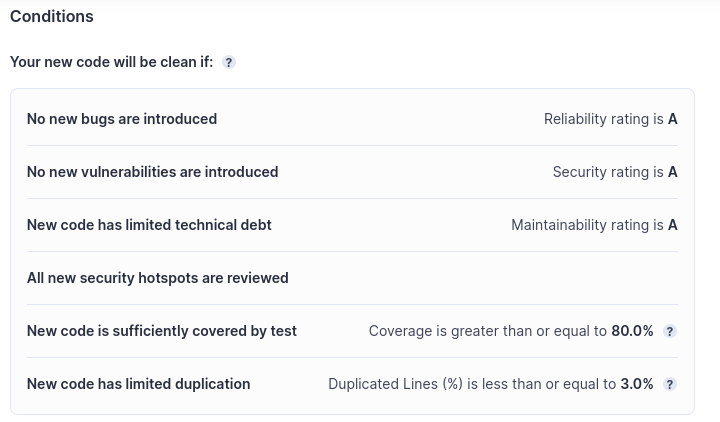

## Question 1-1
### Documentez les éléments essentiels de votre conteneur de base de données: commandes et Dockerfile.

```bash
docker network create app-network
```
Commande pour créer le réseau nécessaire à la communication entre les conteneurs.


```Dockerfile
FROM postgres:14.1-alpine
```
Utilisation de l'image postgres:14.1-alpine comme base pour le Dockerfile de la base de données.

```Dockerfile
COPY ./sql /docker-entrypoint-initdb.d
```
Copie des scripts SQL nécessaires à la création du schéma dans le dossier /docker-entrypoint-initdb.d, assurant ainsi leur exécution au démarrage.

Dans le dossier database :
```bash
docker build -t postgres/tp .
```
Construit l'image a partir avec le tag postgres/tp

```bash
docker run -d -p 5432:5432 --network app-network -v ./volumes:/var/lib/postgresql/data --name postgresTP \
  -e POSTGRES_DB=db \
  -e POSTGRES_USER=usr \
  -e POSTGRES_PASSWORD=pwd \
  postgres/tp
```
Commande pour exécuter le conteneur en mode détaché (-d), en le connectant au réseau app-network, en configurant un volume stocker en local pour stocker les données, en spécifiant le nom du conteneur (--name), et en fournissant des variables d'environnement telles que le nom de la base de données, l'utilisateur et le mot de passe. La dernière partie, postgres/tp, représente le nom de l'image à exécuter.

## Question 1-2
### Pourquoi avons-nous besoin d'une construction à plusieurs étages? Et expliquez chaque étape de ce dockerfile.


La construction à plusieurs étages est utilisée pour réduire la taille de l'image finale. La première étape compile le code Java avec un JDK, et la deuxième étape exécute le code avec un JRE. Cela élimine la nécessité d'avoir un JDK dans l'image finale, réduisant ainsi sa taille et renforçant la sécurité.

Étape de Build (myapp-build)
Sélection de l'image de base pour la construction :

```Dockerfile
FROM maven:3.8.6-amazoncorretto-17 AS myapp-build
```
Utilise l'image de Maven avec Amazon Corretto 17 comme image de base pour la construction.

```Dockerfile
ENV MYAPP_HOME /opt/myapp
WORKDIR $MYAPP_HOME
```
Définit la variable d'environnement MYAPP_HOME et configure le répertoire de travail dans le conteneur.


```Dockerfile
COPY pom.xml .
COPY src ./src
```
Copie le fichier pom.xml et tout le contenu du répertoire src dans le répertoire de travail du conteneur.

```Dockerfile
RUN mvn package -DskipTests
```
Exécute la commande Maven pour construire l'application. L'option -DskipTests permet de ne pas exécuter les tests pendant la construction.

```Dockerfile
FROM amazoncorretto:17
```
Utilise l'image Amazon Corretto 17 comme image de base pour l'exécution.
Définition du répertoire de travail dans le conteneur :

```Dockerfile
ENV MYAPP_HOME /opt/myapp
WORKDIR $MYAPP_HOME
```
Redéfinit la variable d'environnement MYAPP_HOME et configure le répertoire de travail dans le conteneur.

```Dockerfile
Copy code
COPY --from=myapp-build $MYAPP_HOME/target/*.jar $MYAPP_HOME/myapp.jar
```
Copie le fichier JAR résultant de l'étape de build (myapp-build) dans le répertoire de travail du conteneur.

```Dockerfile
ENTRYPOINT java -jar myapp.jar
```
Définit le point d'entrée du conteneur, spécifiant que l'application Java doit être exécutée avec la commande java -jar myapp.jar lors du démarrage du conteneur.

En résumé, ce Dockerfile divise le processus en deux étapes distinctes : la construction de l'application avec Maven dans une image, puis l'exécution de l'application dans une autre image plus légère basée sur Amazon Corretto 17. Cela permet de minimiser la taille de l'image finale et de séparer les dépendances de construction des dépendances d'exécution.


## Question 1-3
### Documentation des éléments essentiels du fichier Docker Compose et les command les plus importants.

```yaml
services:
  database:
    image: excaliduc/sql:1.0
    ports:
      - "5432:5432"
    networks:
      - "app-network"
    volumes:
      - "data:/var/lib/postgresql/data"
    environment:
      - POSTGRES_DB=db
      - POSTGRES_USER=usr
      - POSTGRES_PASSWORD=pwd
```
Utilisation de l'image excaliduc/sql:1.0 pour le service de base de données.
Exposition du port 5432 du conteneur vers le port 5432 de l'hôte.
Connexion au réseau app-network.
Configuration d'un volume nommé data pour stocker les données persistantes.
Définition des variables d'environnement pour le nom de la base de données, l'utilisateur et le mot de passe.
```yml
  backend:
    image: excaliduc/api:1.0
    ports:
      - "8080:8080"
    networks:
      - "app-network"
    depends_on:
      - "database"
    environment:
      - DB_URL=jdbc:postgresql://database:5432/db
      - DB_USER=usr
      - DB_PASSWORD=pwd
```
Utilisation de l'image excaliduc/api:1.0 pour le service backend.
Exposition du port 8080 du conteneur vers le port 8080 de l'hôte.
Connexion au réseau app-network.
Dépendance à l'égard du service database.
Définition des variables d'environnement pour l'URL de la base de données, l'utilisateur et le mot de passe.
```yml
  httpd:
    image: excaliduc/http:1.0
    ports:
      - "80:80"
    networks:
      - "app-network"
    depends_on:
      - "backend"
```
Utilisation de l'image excaliduc/http:1.0 pour le service httpd.
Exposition du port 80 du conteneur vers le port 80 de l'hôte.
Connexion au réseau app-network.
Dépendance à l'égard du service backend.
```yml
networks:
  app-network:
```
Définition du réseau app-network utilisé par tous les services.
```yml
volumes:
  - "data"
```
Définition du volume nommé data utilisé par le service de base de données pour stocker les données persistantes.
```bash
sudo docker-compose -f ./docker-compose.yml -p devops up -d
```
Utilisation de Docker Compose :

sudo docker-compose: Commande pour exécuter Docker Compose 

-f ./docker-compose.yml
Spécifie le fichier de configuration Docker Compose à utiliser

-p devops: Attribue le nom de projet "devops" aux conteneurs créés.

up -d: Lance les services en mode détaché

## Question 1-4
### Documentez vos commandes de publication et les images publiées dans DockerHub.

Pour publier les images sur DockerHub, les étapes sont les suivantes:
Login :```docker login -u excaliduc```

Build des containers :
```bash
docker build -t excaliduc/sql:1.0 -f ./Dockerfile.sql .
docker build -t excaliduc/http:1.0 -f ./Dockerfile.http .
docker build -t excaliduc/api:1.0 -f ./Dockerfile.api .
```  
Push des containers :
```bash
docker push excaliduc/sql:1.0
docker push excaliduc/http:1.0
docker push excaliduc/api:1.0
```

# Github Actions
## Question 2-1
### Qu'est ce qu'un testcontainer

Qu'est-ce qu'un TestContainer :

Un TestContainer est une bibliothèque Java qui simplifie et automatise la gestion des conteneurs Docker lors de l'exécution de tests d'intégration. Il offre un moyen efficace de démarrer, arrêter et configurer des conteneurs Docker directement à partir de vos tests unitaires ou d'intégration.

Gestion automatisée des conteneurs :
TestContainer simplifie la gestion des conteneurs Docker, permettant aux développeurs de spécifier les conteneurs nécessaires pour leurs tests sans avoir à effectuer manuellement des opérations de démarrage, arrêt, etc.

Intégration transparente avec les tests :
Il s'intègre facilement aux frameworks de test Java, tels que JUnit ou TestNG, en fournissant des annotations ou des API spécifiques pour démarrer et arrêter les conteneurs au début et à la fin des tests.


## Question 2-2
### Documentez votre configurations Github Actions.
```yml
name: CI devops test backend

on:
  # Déclenché lors des push sur les branches develop et main
  push:
    branches: [develop, main]

jobs:
  test-backend:
    runs-on: ubuntu-22.04

    steps:
      # Étape 1: Récupérer le code depuis GitHub
      - uses: actions/checkout@v4.1.1

      # Étape 2: Configurer JDK 17
      - name: Set up JDK 17
        uses: actions/setup-java@v4
        with:
          java-version: '17'
          distribution: 'temurin'
          architecture: x64

      # Étape 3: Construire et tester avec Maven
      - name: Build and test with Maven
        run: mvn -B verify sonar:sonar -Dsonar.projectKey=Excaliduc_TP_DevOps -Dsonar.organization=excaliduc -Dsonar.host.url=https://sonarcloud.io -Dsonar.login=${{ secrets.SONAR_TOKEN }} --file ./simple-api-student-main/pom.xml

```

```yml
name: CI build and push Docker image

on:
  # Déclenché lorsqu'une exécution de workflow "CI devops test backend" est terminée
  workflow_run:
    workflows: ["CI devops test backend"]
    branches: [main]
    types:
      - completed

jobs:
  build-and-push-docker-image:
    # Exécuter uniquement lorsque la compilation du code et les tests réussissent
    runs-on: ubuntu-22.04
    if: ${{ github.event.workflow_run.conclusion == 'success' }}

    steps:
      # Étape 1: Récupérer le code depuis GitHub
      - name: Checkout code
        uses: actions/checkout@v2.5.0

      # Étape 2: Connexion à DockerHub
      - name: Login to DockerHub
        run: docker login -u ${{ secrets.DOCKER_HUB_USERNAME }} -p ${{ secrets.DOCKER_HUB_PASSWORD }}

      # Étape 3: Construire et pousser l'image backend
      - name: Build image and push backend
        uses: docker/build-push-action@v3
        with:
          context: ./simple-api-student-main
          tags:  ${{secrets.DOCKER_HUB_USERNAME}}/api:latest
          push: ${{ github.ref == 'refs/heads/main' }}

      # Étape 4: Construire et pousser l'image database
      - name: Build image and push database
        uses: docker/build-push-action@v3
        with:
          context: ./database
          tags:  ${{secrets.DOCKER_HUB_USERNAME}}/sql:latest
          push: ${{ github.ref == 'refs/heads/main' }}

      # Étape 5: Construire et pousser l'image du rivers proxy 
      - name: Build image and push httpd
        uses: docker/build-push-action@v3
        with:
          context: ./http
          tags:  ${{secrets.DOCKER_HUB_USERNAME}}/http:latest
          push: ${{ github.ref == 'refs/heads/main' }}

      # Étape 6: Construire et pousser l'image frontend
      - name: Build image and push frontend
        uses: docker/build-push-action@v3
        with:
          context: ./devops-front-main
          tags:  ${{secrets.DOCKER_HUB_USERNAME}}/front:latest
          push: ${{ github.ref == 'refs/heads/main' }}

      # Étape 7: Exécuter le playbook Ansible avec le vault
      - name: Run playbook
        uses: dawidd6/action-ansible-playbook@v2
        with:
          playbook: playbook.yml
          directory: ./ansible
          key: ${{secrets.ID_RSA_TP_ANSIBLE}}
          vault_password: ${{secrets.ANSIBLE_VAULT}}
          options: |
            --inventory inventories/setup.yml
            --extra-vars "@secret.yml"

```

## Question 2-3
### Documentez votre configuration quality gate.


Chaque note attribuée ne doit pas surpasser la lettre A, dénotant ainsi une exigence de qualité élevée pour chaque aspect évalué. De plus, une attention particulière est portée à deux métriques clés : la couverture des tests et le taux de duplication du code. La couverture des tests doit atteindre un seuil minimum de 80%, indiquant une validation étendue des différentes parties du code par des tests automatisés. Parallèlement, le taux de duplication du code doit demeurer en deçà de 3%, soulignant l'importance de maintenir une base de code claire et exempte de redondances inutiles.

L'échec de l'étape du portail de qualité dans le processus d'intégration continue survient si l'une de ces conditions n'est pas respectée, signalant ainsi la nécessité d'une réévaluation et d'une amélioration avant de permettre la poursuite du flux de travail. Cela garantit que chaque contribution au code source répond aux normes de qualité spécifiées, contribuant ainsi à la stabilité et à la maintenabilité globales du projet.


# Github ActioSkip to content


## Question 3-1
### Documentez votre inventory et les commandes

L'inventaire (inventory) est une structure définissant les hôtes sur lesquels Ansible va effectuer des opérations. Dans cet exemple, l'inventaire est défini dans un fichier YAML nommé inventory et comprend une configuration pour un groupe appelé prod. Voici le contenu de l'inventaire :

```yaml
all:
 vars:
  ansible_user: centos
  ansible_ssh_private_key_file: .ansible_key
 children:
   prod:
     hosts: centos@antoine.ducret.takima.cloud
```
all: Définit toutes les configurations pour l'inventaire.
vars: Spécifie des variables globales pour l'inventaire, telles que l'utilisateur Ansible (ansible_user) et le fichier de clé privée SSH (ansible_ssh_private_key_file).
children: Contient des groupes d'hôtes, et dans cet exemple, il y a le groupe prod.
prod: Groupe d'hôtes contenant les détails de connexion pour l'hôte spécifique centos@antoine.ducret.takima.cloud.


```bash
ansible all -i inventories/setup.yml -m ping
```
Cette commande utilise Ansible pour envoyer un ping à tous les hôtes définis dans l'inventaire inventories/setup.yml. Elle permet de vérifier la connectivité avec les hôtes.

```bash
ansible all -i inventories/setup.yml -m setup -a "filter=ansible_distribution*"
```
Cette commande utilise Ansible pour récupérer des informations détaillées sur tous les hôtes spécifiés dans l'inventaire inventories/setup.yml. Elle filtre les résultats pour ne montrer que des informations liées à la distribution du système d'exploitation.

```bash
ansible all -i inventories/setup.yml -m yum -a "name=httpd state=absent" --become
```
Cette commande utilise Ansible pour désinstaller le paquet Apache httpd sur tous les hôtes spécifiés dans l'inventaire. L'option --become est utilisée pour obtenir les privilèges de superutilisateur.

```bash
ansible-playbook -i inventories/setup.yml playbook.yml
```
Cette commande exécute un playbook Ansible spécifié (playbook.yml) en utilisant l'inventaire inventories/setup.yml. Les playbooks sont des scripts Ansible qui automatisent des tâches spécifiques sur les hôtes.

```bash
ansible-galaxy init roles/frontend
```
Cette commande initialise une structure de rôle Ansible pour le frontend. Les rôles sont des ensembles d'instructions et de fichiers organisés pour effectuer une tâche spécifique dans Ansible.

```bash
ansible-galaxy collection install community.hashi_vault
```
Cette commande installe une collection Ansible spécifique (dans cet exemple, community.hashi_vault). Les collections regroupent des contenus liés à Ansible, tels que des modules, des rôles et des plugins.

```bash
ansible-vault create secret.yml
```
Cette commande utilise Ansible Vault pour créer un nouveau fichier chiffré (secret.yml). Ansible Vault permet de chiffrer des fichiers sensibles tels que des informations d'identification.

```bash
ansible-vault encrypt secret.yml
```
Cette commande utilise Ansible Vault pour chiffrer un fichier existant (secret.yml). Le fichier chiffré ne peut être lu que par des utilisateurs autorisés avec la clé correcte.

```bash
ansible-vault decrypt secret.yml
```
Cette commande utilise Ansible Vault pour déchiffrer un fichier chiffré (secret.yml). Elle permet de revenir à la version non chiffrée du fichier pour des modifications.


## Qestion 3-2
### Documentez votre playbook, docker_container, tasks et configuration

#### Playbook.yml 

Fichier playbook "playbook.yml":

```yaml
- hosts: all
  gather_facts: false
  become: true
```
La première partie de ce playbook cible tous les hôtes définis dans l'inventaire.
gather_facts: false: Désactive la collecte automatique de facts sur les hôtes. La collecte de facts recueille des informations sur les hôtes, mais dans ce cas, elle est désactivée.
become: true: Permet d'obtenir des privilèges d'administrateur (sudo) lors de l'exécution des tâches sur les hôtes.

```yaml
- hosts: centos@antoine.ducret.takima.cloud
  become: yes
  roles:
    - docker
    - network
    - database
    - app
    - proxy
    - frontend
```
La deuxième partie de ce playbook cible spécifiquement l'hôte avec "centos@antoine.ducret.takima.cloud"

become: yes: Comme dans la première partie, cela permet d'obtenir des privilèges d'administrateur sur cet hôte.
roles: Spécifie une liste de rôles Ansible à appliquer à cet hôte. Dans cet exemple, les rôles suivants seront exécutés dans l'ordre spécifié: Docker, Network, Database, App, Proxy, Frontend.
Note: Les rôles mentionnés (docker, network, database, app, proxy, frontend) sont probablement des dossiers ou des structures de rôles définis dans le répertoire du projet. Chacun de ces rôles pourrait contenir des tâches, des handlers et d'autres fichiers nécessaires pour accomplir des actions spécifiques lors du déploiement de l'application.

#### docker

```yaml
- name: Install device-mapper-persistent-data
  yum:
    name: device-mapper-persistent-data
    state: latest
```
Cette tâche utilise le module Ansible yum pour installer le paquet device-mapper-persistent-data avec la version la plus récente sur le système.

```yaml
- name: Install lvm2
  yum:
    name: lvm2
    state: latest
```
Installe le paquet lvm2 avec la version la plus récente à l'aide du module yum.

```yaml
- name: add repo docker
  command:
    cmd: sudo yum-config-manager --add-repo=https://download.docker.com/linux/centos/docker-ce.repo
```
Ajoute le référentiel Docker au système à l'aide de la commande yum-config-manager.

```yaml
- name: Install Docker
  yum:
    name: docker-ce
    state: present
```
Installe le paquet docker-ce avec le module yum.

```yaml
- name: Install python3
  yum:
    name: python3
    state: present
```
Installe Python 3 sur le système avec le module yum.

```yaml
- name: Install docker with Python 3
  pip:
    name: docker
    executable: pip3
  vars:
    ansible_python_interpreter: /usr/bin/python3
```
Utilise le module pip pour installer le module Python docker avec Python 3. La variable ansible_python_interpreter est définie pour s'assurer que la version correcte de Python est utilisée.

```yaml
- name: Make sure Docker is running
  service:
    name: docker
    state: started
  tags: docker
```
S'assure que le service Docker est démarré en utilisant le module service. La tâche est étiquetée avec docker pour être référencée ultérieurement dans l'exécution du playbook.

```yaml
- name: Docker Hub Login
  docker_login:
    username: "{{ docker_hub_username }}"
    password: "{{ docker_hub_password }}"
```
Utilise le module docker_login pour se connecter à Docker Hub en utilisant les variables docker_hub_username et docker_hub_password. Les variables sont généralement définies dans un fichier d'inventaire ou des variables d'environnement.

#### network

```yml
- name: Créer un réseau Docker (si nécessaire)
  docker_network:
    name: app-network
    driver: bridge
```
Cette tâche utilise le module Ansible docker_network pour créer un réseau Docker nommé app-network avec le driver bridge. Ce réseau sera utilisé pour connecter les différents conteneurs de l'application afin de faciliter la communication entre eux.


#### database
```yml
- name: Setup docker postgres
  block:
    - name: Pull docker image
      docker_image:
        name: "{{docker_hub_username}}/sql:latest"
        source: pull

    - name: Run Docker container
      docker_container:
        name: database
        image: "{{docker_hub_username}}/sql:latest"
        state: started
        recreate: true
        pull: true
        restart_policy: always
        env:
          POSTGRES_DB: "{{postgres_db}}"
          POSTGRES_USER: "{{postgres_user}}"
          POSTGRES_PASSWORD: "{{postgres_password}}"
        networks:
          - name: app-network
```
 Ce rôle est chargé de configurer et de démarrer un conteneur Docker PostgreSQL. Le module Ansible docker_image est utilisé pour pull l'image Docker spécifiée, et docker_container est utilisé pour créer et démarrer un conteneur nommé "database". Les variables telles que docker_hub_username, postgres_db, postgres_user et postgres_password sont utilisées pour personnaliser la configuration du conteneur. Le conteneur est également connecté au réseau Docker app-network pour permettre la communication avec d'autres conteneurs de l'application.


#### app

```yml
- name: Setup docker app
  block:
    - name: Pull docker image
      docker_image:
        name: "{{docker_hub_username}}/api:latest"
        source: pull

    - name: Run Docker container
      docker_container:
        name: backend
        image: "{{docker_hub_username}}/api:latest"
        state: started
        restart_policy: always
        env:
          DB_URL: "{{db_url}}"
          DB_USER: "{{db_user}}"
          DB_PASSWORD: "{{db_password}}"
        networks:
          - name: app-network
```
Ce role est responsable de la configuration et du démarrage d'un conteneur Docker pour l'application backend. Il utilise le module Ansible docker_image pour tirer l'image Docker spécifiée et docker_container pour créer et démarrer un conteneur nommé "backend". Les variables telles que docker_hub_username, db_url, db_user, et db_password sont utilisées pour personnaliser la configuration du conteneur. Le conteneur est également connecté au réseau Docker app-network pour permettre la communication avec d'autres composants de l'application.

#### proxy
```yml
- name: Setup docker http
  block:
    - name: Pull docker image
      docker_image:
        name: "{{docker_hub_username}}/http:latest"
        source: pull

    - name: Run Docker container
      docker_container:
        name: http
        image: "{{docker_hub_username}}/http:latest"
        state: started
        restart_policy: always
        recreate: true
        pull: true
        ports:
          - "80:80"
        networks:
          - name: app-network
```
Ce role est responsable de la configuration et du démarrage d'un conteneur Docker pour le composant HTTP. Il utilise le module Ansible docker_image pour tirer l'image Docker spécifiée et docker_container pour créer et démarrer un conteneur nommé "http". Le conteneur est configuré pour redémarrer toujours, tirer l'image si elle n'est pas présente localement, et exposer le port 80 sur l'hôte. Il est également connecté au réseau Docker app-network pour permettre la communication avec d'autres composants de l'application.


#### frontend
```yml
- name: Setup docker frontend
  block:
    - name: Pull docker image
      docker_image:
        name: "{{docker_hub_username}}/front:latest"
        source: pull

    - name: Run Docker container
      docker_container:
        name: front
        image: "{{docker_hub_username}}/front:latest"
        state: started
        restart_policy: always
        recreate: true
        pull: true
        networks:
          - name: app-network
```
Ce role est chargé de configurer et de démarrer un conteneur Docker pour le composant Frontend. Il utilise le module Ansible docker_image pour tirer l'image Docker spécifiée et docker_container pour créer et démarrer un conteneur nommé "front". Le conteneur est configuré pour redémarrer toujours, tirer l'image si elle n'est pas présente localement, et est connecté au réseau Docker app-network pour permettre la communication avec d'autres composants de l'application.